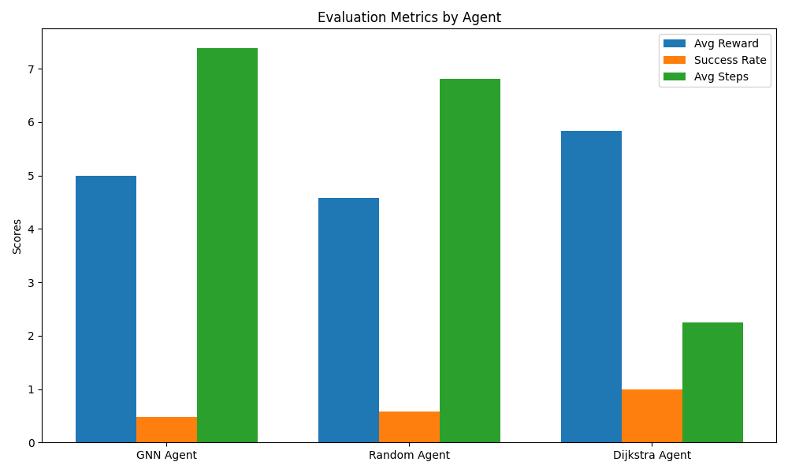
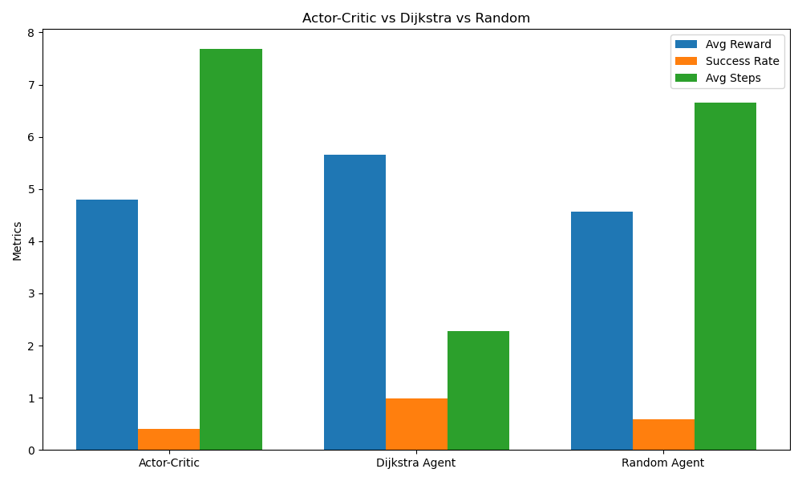

# 🚀 DRIFT: Deep Reinforcement Intelligent Financial Transaction Routing

**Author:** Sharath
**Domain:** Reinforcement Learning (RL), Graph Neural Networks (GNNs), Financial Networks
**Goal:** Surpass traditional routing algorithms (like Dijkstra) using DRL in financial networks, while pushing production-grade innovation and skill showcase.

---

## 🧠 Business Problem & Motivation

In modern financial systems like **payment channels (e.g., Lightning Network)** or **interbank settlements**, intelligently routing a transaction across a dynamic graph of counterparties is a foundational challenge. Factors like channel capacity, latency, regulation, and risk profiles mean shortest-path algorithms like **Dijkstra** are insufficient.

**Pain Point:**
Traditional path-finding (e.g., Dijkstra, Bellman-Ford) does not adapt to *dynamic*, *partially observable*, or *blocked* routes in real-time systems. They also **do not learn** from failure cases, leading to inefficient or failed transaction attempts.

**Industry Need:**
A routing mechanism that **learns from experience**, **adapts to dynamic edge properties**, and **considers non-obvious strategies** is highly valuable in decentralized and regulated transaction environments.

---

## 💡 Our Approach

We designed **DRIFT** — a multi-phase research-driven RL framework for **intelligent financial transaction routing** using **Graph Neural Networks (GNNs)** and **Reinforcement Learning (RL)**. Each phase builds upon the previous, pushing toward real-world deployment readiness.

---

## 🧩 Phases Breakdown

### ### Phase 1: Baseline GNN Agent

**Script:** `train_drift_agent1.py`
**Method:** GNN with supervised pretraining on Dijkstra paths
**Architecture:**

* GNN using `SAGEConv` (node features only)
* Prediction: next hop from current node to destination
* Loss: Cross-entropy over valid neighbors (Dijkstra label supervision)

**Motivation:** Understand if GNNs alone can mimic deterministic routing strategies.

**Result Highlights:**
✅ GNN outperformed **Random**
❌ Still behind **Dijkstra**
📈 Reward: \~5.0 vs Dijkstra's 5.8
📉 Avg Steps: 7.4 (GNN) vs 2.3 (Dijkstra)

📊 

---

### ### Phase 2: Reinforcement Learning GNN Agent

**Script:** `train_drift_agent2.py`
**Method:** Policy Gradient RL with node features only
**Architecture:**

* GNN + Softmax policy over neighbors
* Reward: -1 per step, +10 on success, -10 on fail
* No explicit Dijkstra supervision

**Motivation:** Let the model learn optimal routing via trial-and-error without fixed path bias.

**Result Highlights:**
✅ Better reward than Random again
❌ Still behind Dijkstra on steps and success
❗ Reward plateaued; learning signal weak due to sparse reward
📉 Success: \~50% vs Dijkstra’s 100%

📊 

---

### ### Phase 3: Actor-Critic GNN Agent with Advantage Learning

**Script:** `train_drift_agent3.py`
**Method:** Advantage Actor-Critic (A2C) with GNN
**Architecture:**

* Shared GNN backbone
* Two heads: `Actor` (policy logits) + `Critic` (value estimate)
* Advantage = return − value
* Stable training using masked categorical distribution
* Explored adaptive node features and gradient normalization

**Motivation:** Improve learning stability and policy precision under sparse feedback and dynamic transitions.

**Result Highlights:**
✅ Reward improved consistently
✅ Learning stabilized with advantage normalization
❌ Still behind Dijkstra, but outperforming GNN + Random
📈 Reward: \~4.8 (vs 4.5 Random, 5.7 Dijkstra)
📉 Steps: \~7.6 vs 6.7 (Random), 2.3 (Dijkstra)

📊 

---

## 🛠️ Tech Stack

| Component         | Tools / Libraries                       |
| ----------------- | --------------------------------------- |
| RL Algorithms     | Policy Gradient, Actor-Critic (PyTorch) |
| Graph Learning    | `torch-geometric`, `SAGEConv`           |
| Visualization     | `matplotlib`, `tensorboard`             |
| Environment       | Custom `TransactionRoutingEnv`          |
| Evaluation Agents | Dijkstra, Random, GNN RL Agents         |
| Platform          | Python 3.11+, PyTorch 2.5+, MacOS (M1)  |

---

## 📊 Evaluation Strategy

We compare agents on 3 key metrics over 100 episodes:

* **Average Reward**: higher = better policy performance
* **Success Rate**: fraction of transactions successfully routed
* **Average Steps**: lower = more efficient path

Agents:

* `Random`: naive baseline
* `Dijkstra`: fixed benchmark
* `GNN`, `Actor-Critic`: learning agents

---

## 📂 File Structure

```
DRIFT/
├── drift_env.py               # Custom routing environment
├── train_drift_agent1.py      # GNN supervised trainer
├── train_drift_agent2.py      # GNN RL (policy gradient)
├── train_drift_agent3.py      # Actor-Critic trainer
├── evaluate_agent.py          # Benchmark & plot comparison
├── evaluate_actor_critic.py   # Actor-Critic focused evaluator
├── graph_simulator.py         # Graph creation utilities
├── drift_actor_critic.pt      # Final trained model
├── *.png                      # All evaluation plots
```

---

## 🚀 Future Scope

1. **Hierarchical RL:** Split path planning and local routing into sub-agents
2. **Edge Feature Integration:** Include latency, fee, congestion in edge embeddings
3. **Curriculum Learning:** Gradually increase complexity of routing tasks
4. **Transfer Learning:** Pretrain on simpler topologies; fine-tune on real networks
5. **Multi-Agent Routing:** Simulate concurrent transaction flows and interference
6. **GANs or GFlowNets:** Explore generative models for alternative path distributions
7. **Deployment:** Integrate with Lightning Network simulations (e.g., lnd, c-lightning)

---

##  Conclusion

DRIFT demonstrates how **deep learning and graph reasoning** can transform a classical domain like financial routing. While we haven’t yet dethroned Dijkstra on all fronts, we’ve shown consistent improvements across phases, robust training workflows, and strong experimentation.

This project is a **technical portfolio piece** that proves capability in:

* Designing complex RL systems
* Working with GNNs in custom environments
* Debugging real-world ML errors
* Communicating ML outcomes with integrity

---
